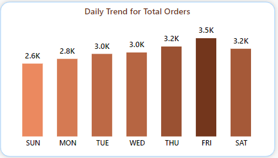

# Pizza-sales-dashboard-
An interactive Power BI dashboard analyzing pizza sales data to uncover key business insights, trends, and performance metrics. Includes KPIs, visualizations, and actionable insights to support data-driven decision-making.
- [Pizza_Sales.pbix](Pizza_Sales.pbix)
This project is a data analysis and visualization initiative aimed at understanding the sales performance of a pizza business. By leveraging Power BI, the project explores key metrics and trends to uncover insights that can drive operational improvements and strategic decision-making. By calculating and visualizing KPIs, the dashboard provides actionable insights into revenue, order trends, and product performance.

The dataset contains pizza sales records, including details like order IDs, pizza categories, sizes, timestamps, and revenue etc. Data cleaning involved handling missing values, removing duplicates, and standardizing formats.

# Key Performance Indicators (KPIs):
The dashboard calculates the following metrics to understand business performance:
1. Total Revenue: The sum of all pizza orders' total prices.
2. Average Order Value: The average spend per order, calculated as total revenue divided by the number of orders.
3. Total Pizzas Sold: The total number of pizzas sold across all categories.
4. Total Orders: The total count of orders placed.
5. Average Pizzas Per Order: The average number of pizzas sold per order, calculated as total pizzas divided by total orders.
      

# Visualization Requirements:
The following charts and visualizations were created to highlight trends and insights:
1. Daily Trend for Total Orders: A bar chart to identify daily patterns and high/low-performing days. 
2. Monthly Trend for Total Orders: A line chart to detect peak periods or months with lower activity. 
4. Percentage of Sales by Pizza Category: A donut chart to understand category contributions to overall sales. 
5. Percentage of Sales by Pizza Size: A donut chart to analyze customer preferences by pizza size. 
6. Total Pizzas Sold by Pizza Category: A funnel chart to compare category-wise performance. 
7. Top 5 Best Sellers: Three bar charts (revenue, quantity, and orders) to identify the most popular and high-performing pizzas. 
8. Bottom 5 Worst Sellers: Three bar charts (revenue, quantity, and orders) to highlight underperforming products for improvement or  discontinuation. 

# Key Insights Provided:
1. Orders peak on weekends, especially Friday and Saturday evenings.
2. The Classic category generates the highest sales and total orders.
3. Large pizzas contribute the most to revenue.
4. The Thai Chicken Pizza drives maximum revenue.
5. The Classic Deluxe Pizza leads in total quantities and orders.
6. The Brie Care Pizza ranks lowest in revenue, total quantities, and total orders.

#  How to Run the Project
1. Download - [Pizza_Sales.pbix](Pizza_Sales.pbix) from the repository.
2. Open the file in Power BI Desktop.
3. Use slicers and filters to explore the interactive dashboard.

# Future Scope

1. Real-Time Data Integration: Add live sales tracking for real-time insights.
2. Machine Learning for Forecasting: Predict high-demand periods and optimize inventory.
3. Geographical Analysis: Visualize sales trends across regions with maps.
4. Customer Behavior Insights: Analyze purchase patterns for targeted marketing.
5. Automated Reporting: Set up scheduled email reports for stakeholders.
